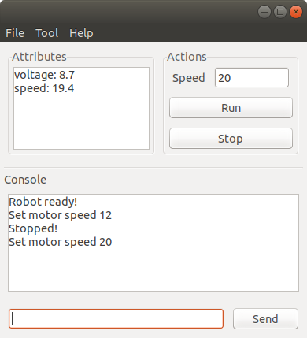
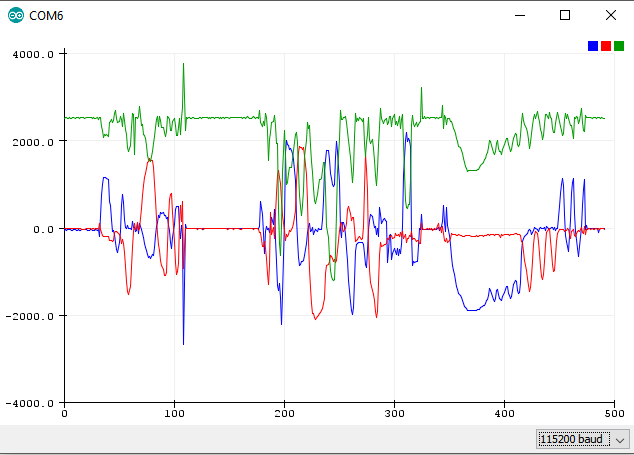
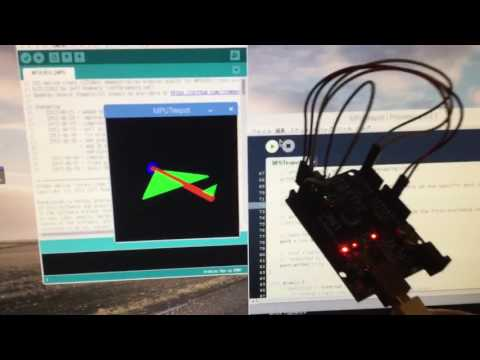

# Robot Monitor
In programming an MCU for robots, it is usually needed to what how the data input and output are going on. In the example of a line following robot, IR sensor input values and PID controller output value are displayed by means of text or graph.

**Robot Monitor** is a visualization tool written in **C++** and **Python**. The **Robot Monitor** software make it possible to use CLI-like interface, custom GUI for machine control, graphing and 3D visualization. In case of debugging a particular system, UI widgets can replace the circuits of buttons, switches and potentiometers. Compared with traditional consoles, attributes, graphs and logs are separated.

</img>

The GUI is built with **Wx Widgets** library and a design tool **Wx Smith**.

The following are graph and 3D visualization references which will be implemented in this software later.

</img>

</img>

In order to use this software, a client library for MCU is needed.

Link to **Robot Monitor Client** library: https://github.com/khantkyawkhaung/robot-monitor-client

